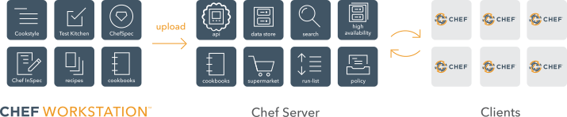

# CHEF INFRA
- chef infra is a powerful automation platform that transforms infrastructure into code. Whether you are operating in the cloud, on-premises, or in a hybrid environment, Chef infra automates how infrastructure is configured, deployed, and managed across your network, no matter its size.
- The following diagram shows how we can manage infra using chef
 

- `Chef Workstation`: The location where users interact with Chef infra. With chef workstation, users can author and test *cookbooks* using tools such as `Test Kitchen` and interact with the Chef Infra Server using the `knife` and `chef` command line tools.
- `Chef Infra Client`: It runs on systems that are managed by chef infra. The chef infra client executes on a schedule to configure a system to the desired state.
- `Chef Infra Server`: It acts as a hub for configuration data. Chef infra server stores cookbooks, the policies that are applied to nodes, and the metadata that describes each registered node that is being managed by the Chef. Nodes use the chef infra client to ask the chef infra server for configuration details, such as recipes, templates and file distributions.

## Chef Infra Components
### Chef Workstation
- One or more workstations are configured to allow users to author, test and maintain cookbooks.
- Workstation systems run the chef workstation package which includes tools such as Chef Infra Client, Chef InSpec, Test Kitchen, ChefSpec, CookStyle and other tools necessary for development and testing your infrastructure with Chef products.
### CookBooks
- CookBooks are uploaded into the chef infra server from these workstations. Some cookbooks are custom to the organization, and others are based on community cookbooks available from the Chef Supermarket.
### Ruby
- Ruby is a programming language that's the authoring the syntax for cookbooks. Most recipes are simple patterns (blocks that define properties and values that map to specific configuration items like packages, files, services, templates, and users.)
### Node
- A node is any device physical, virtual, cloud, network device etc., that is under management by Chef Infra.
### Chef Client:
- Chef Infra client is installed on each node managed with Chef Infra. Chef Infra Client configures the node locally by performing the tasks specified in the run-list. Chef Infra Client will also pull down any required configuration data from the Chef Infra Server during a Chef Infra Client run.
### Chef Sever
- The Chef Infra Server acts as a hub of information. Cookbooks and policy settings are uploaded to the Chef Infra Server by users from workstations.
- The Chef Infra Client accesses the Chef Infra Server from the node on which it's installed to get configuration data, performs search of historical Chef Infra Client run data, and then pulls down necessary configuration data. After a chef Infra Client run is finished, the Chef Infra Client uploads the updated run data to the Chef Infra Server.
### Chef Supermarket
- Chef Supermarket is the location in which community cookbooks are shared and managed. Cookbooks that are part of the Chef Supermarket may be used by any Chef user. How community cookbooks are used varies from organization to organization.

## Workstations
- A workstation is your local computer running chef workstation that you use to author cookbooks, interact with the Chef Infra Server, and interact with nodes.
- The workstation is where users do most of their work, including:
  - Developing and testing cookbooks
  - Keeping the Chef Infra repository synchronized with the version source control.
  - Configuring Organizational policy by including defining roles and applying Policyfiles or policy groups.
  - Interacting with the nodes, or (or when) required, such as performing a bootstrap operation.
- `Chef Workstation Components`:
  - `chef infra`: use the chef commandline tool to work with items in a chef-repo, which is the primary location in which cookbooks are authorized, tested and maintained, and from which policy is uploaded to the Chef Infra Server.
  - `Knife`: Use the knife commandline tool to interact with nodes or work with objects on the chef infra server.
  - `Chef Infra Client`: an agent that configures our nodes.
  - `Test Kitchen`: A testing harness for rapid validation of Chef code.
  - `Chef Inspec`: Chef's open source security & compliance automation framework.
  - `chef-run`: a tool for running ad-hoc tasks
  - `chef-repo`: chef repo is the repository structure in which cookbooks are authorized, tested and maintained:
    - cookbooks contains recipes, attributes, custom resources, libraries, files, templates, tests, and metadata.
    - The chef-repo should be synchronized with a version control system (such as git), and then managed as if it were source code.
    - The directory structure within the chef-repo varies. SOme organizations prefer to keep all of their cookbooks in a single chef-repo, while other organizations prefer to use a chef-repo for every cookbook.
  - `Test Kitchen`: Use Test Kitchen to test cookbooks acoss any combination of platforms and test suites:
    - Test suites are defined in a kitchen.yml file.
    - Supports cookbook testing across many cloud providers and virtualization technologies.
  - `ChefInSpec`: use ChefInSpec to simulate the convergence of resources on a node:
    - In a extension of RSpec, a behavior-driven development (BDD) framework for Ruby
    - Is the fastest way to test the resources and recipes.

## Cookbooks
- A cookbook is the fundamental unit of configuration and policy distribution in Chef Infra.
- A cookbook defines a scenario and contains everything that's required to support a scenario:
  - Recipes that specify which chef infra built-in resources to use, as well as the order in which they are to be applied.
  - Attribute Values, which allow environment-based configurations such as `dev` or `production`.
  - Custom Resources for extending Chef Infra beyond the built-in resources.
  - Files and Templates for distributing information to systems.
  - Custom Ohai Plugins for extending the system configuration collection beyond ohai defaults.
  - The `metadata.rb` file, which describes the cookbook itself and any dependencies it may have.